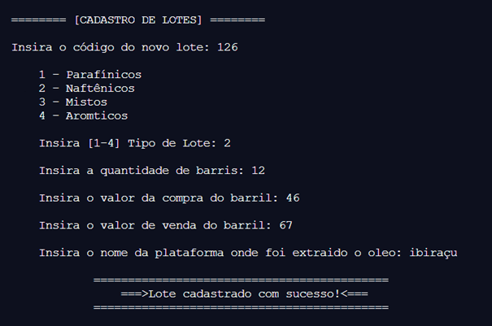
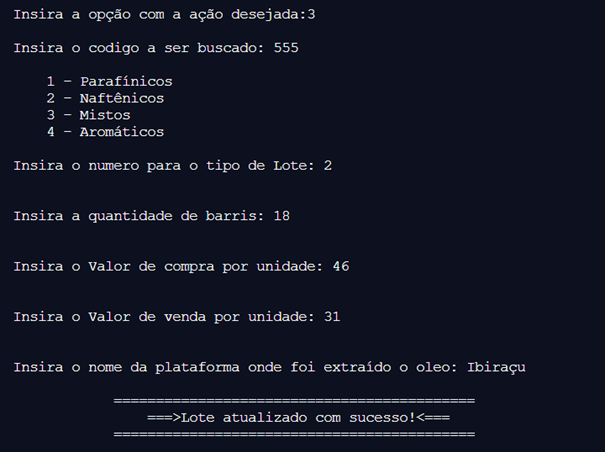
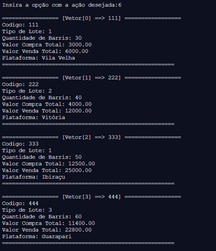

# Programa de empresa de petróleo

Trabalho de programação de computadores-Aline Amy, Bernardo Zampirole, Diana Rosalém.
Programa feito em c, com o contexto de uma empresa de petróleo

# Contexto

Produtos originados do petróleo e Tipos de Petróleo:

O petróleo é um produto de grande importância mundial, principalmente em nossa atualidade. É difícil determinar alguma coisa que não dependa direta ou indiretamente do petróleo.

Os solventes, óleos combustíveis, gasolina, óleo diesel, querosene, gasolina de aviação, lubrificantes, asfalto, plástico entre outros são os principais produtos obtidos a partir do petróleo.

De acordo com a predominância dos hidrocarbonetos encontrados no óleo cru, o petróleo é classificado em:

Parafínicos

Quando existe predominância de hidrocarbonetos parafínicos. Este tipo de petróleo produz subprodutos com as seguintes propriedades:

- Gasolina de baixo índice de octanagem. - Querosene de alta qualidade. - Óleo diesel com boas características de combustão. - Óleos lubrificantes de alto índice de viscosidade, elevada estabilidade química e alto ponto de fluidez. - Resíduos de refinação com elevada percentagem de parafina. - Possuem cadeias retilíneas.

Naftênicos

Quando existe predominância de hidrocarbonetos naftênicos. O petróleo do tipo naftênico produz subprodutos com as seguintes propriedades principais:

- Gasolina de alto índice de octanagem. - Óleos lubrificantes de baixo resíduo de carbono. - Resíduos asfálticos na refinação. - Possuem cadeias em forma de anel.

Mistos

Quando possuem misturas de hidrocarbonetos parafínicos e naftênicos, com propriedades intermediárias, de acordo com maior ou menor percentagem de hidrocarbonetos parafínicos e Naftênicos.

Aromáticos

Quando existe predominância de hidrocarbonetos aromáticos. Este tipo de petróleo é raro, produzindo solventes de excelente qualidade e gasolina de alto índice de octanagem. Não se utiliza este tipo de petróleo para a fabricação de lubrificantes.

Após a seleção do tipo desejável de óleo cru, o mesmo é refinado através de processos que permitem a obtenção de óleos básicos de alta qualidade, livres de impurezas e componentes indesejáveis.

Chegando às refinarias, o petróleo cru é analisado para conhecer-se suas características e definir-se os processos a que será submetido para obter-se determinados subprodutos.
## Imagens 

# Referencias

- PINHEIRO, Erlon. Apostila Algoritmos PC. Vila Velha : 2020.

- PINHEIRO, Erlon. APOSTILA _PC_ MATRIZES. Vila Velha : 2020

- PINHEIRO, Erlon. APOSTILA _PC_ STRINGS. Vila Velha : 2020

- PINHEIRO, Erlon. Programação de Computadores. Vila Velha : 2020

